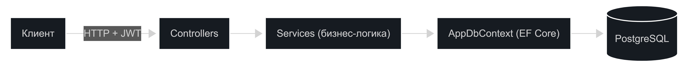

# FinanceTracker

REST API для учёта личных финансов: пользователь регистрируется, заводит счета и категории, записывает доходы и расходы и смотрит статистику за период. Каждый пользователь видит и изменяет только свои данные.

Учебный pet-проект для отработки backend-разработки на .NET: REST API, аутентификация по JWT, работа с БД через EF Core, агрегации и расчёты на стороне базы.

## Стек

- **.NET 10** / ASP.NET Core Web API
- **Entity Framework Core 10** (code-first, авто-миграции)
- **PostgreSQL** (провайдер Npgsql)
- **JWT** (Bearer) для аутентификации, **BCrypt** для хеширования паролей
- **DotNetEnv** для управления конфигурацией через `.env` файлы
- **Swagger / OpenAPI** (Swashbuckle) для документации и ручного тестирования
- **Docker** / Docker Compose

## Архитектура



Зависимости идут в одну сторону: `Controllers → Services → AppDbContext`. Наружу отдаются только DTO, сущности EF за пределы сервисов не выходят. `UserId` берётся из проверенного JWT-токена, поэтому пользователь работает только со своими данными.

## Возможности

- Регистрация и логин с выдачей JWT-токена
- CRUD по счетам (наличные / карта / накопления)
- CRUD по категориям доходов и расходов
- CRUD по транзакциям с фильтрами (по счёту, категории, периоду) и пагинацией
- Статистика (сводка за месяц, разбивка по категориям)
- Глобальная обработка ошибок (единый формат `ProblemDetails`)
- **Автоматическое применение миграций** базы данных при запуске приложения
- Безопасное хранение секретов и настроек через `.env` файл

## Структура проекта

```
FinanceTracker/
├── Controllers/      — приём HTTP-запросов
├── Services/         — бизнес-логика (+ Interfaces/)
├── Data/             — AppDbContext, миграции
├── Models/
│   ├── Entities/     — сущности БД
│   └── Dtos/         — модели запросов и ответов
├── Middleware/       — глобальный обработчик исключений
└── Program.cs        — конфигурация приложения
```

## Запуск локально

### Предварительно

- [.NET 10 SDK](https://dotnet.microsoft.com/download)
- Запущенный Docker (для базы данных)

### Шаги

1. **Создайте файл `.env`** в корне проекта (рядом с `.gitignore` / `docker-compose.yml`) и добавьте в него настройки:
   ```env
   POSTGRES_USER=postgres
   POSTGRES_PASSWORD=postgres
   POSTGRES_DB=financetracker
   POSTGRES_PORT=5432
   JWT_KEY=длинная-случайная-строка-минимум-32-символа
   ```
   *(Этот файл добавлен в `.gitignore` и не попадёт в репозиторий).*

2. **Поднимите базу данных** (PostgreSQL) с помощью Docker Compose:
   ```bash
   docker compose up -d db
   ```

3. **Запустите приложение** (перейдите в папку с `.csproj`):
   ```bash
   cd FinanceTracker
   dotnet run
   ```
   > При старте пакет `DotNetEnv` автоматически подтянет переменные из `.env` файла и подставит их в `appsettings.json`. База данных создастся и **накатит миграции автоматически**.

4. Откройте `http://localhost:<порт>/swagger`.

## Запуск полностью через Docker Compose

Чтобы поднять и базу данных, и само приложение вместе одной командой:

```bash
docker compose up --build
```

Пример нашего `docker-compose.yml`:

```yaml
services:
   db:
      image: postgres:17
      container_name: finance-pg
      environment:
         POSTGRES_USER: ${POSTGRES_USER}
         POSTGRES_PASSWORD: ${POSTGRES_PASSWORD}
         POSTGRES_DB: ${POSTGRES_DB}
      ports:
         - "${POSTGRES_PORT}:5432"
      volumes:
         - finance-pgdata:/var/lib/postgresql/data

   app:
      build:
         context: .
         dockerfile: FinanceTracker/Dockerfile
      depends_on:
         - db
      ports:
         - "8080:8080"
      environment:
         ConnectionStrings__Default: "Host=db;Port=5432;Database=${POSTGRES_DB};Username=${POSTGRES_USER};Password=${POSTGRES_PASSWORD}"
         Jwt__Key: ${JWT_KEY}
         ASPNETCORE_ENVIRONMENT: "Development"

volumes:
   finance-pgdata:
```

> Docker Compose автоматически прочитает значения из вашего `.env` файла и прокинет их в контейнеры. Внутри Docker-сети сервисы видят друг друга по имени, поэтому в строке подключения для приложения хост указан как `db`.

## Аутентификация

1. `POST /api/auth/register` — создать пользователя (email + пароль).
2. `POST /api/auth/login` — получить JWT-токен.
3. В Swagger нажать **Authorize**, вставить токен — защищённые эндпоинты станут доступны.

## Основные эндпоинты

| Метод | Путь | Описание |
|-------|------|----------|
| POST | `/api/auth/register` | Регистрация |
| POST | `/api/auth/login` | Логин, выдача токена |
| GET/POST/PUT/DELETE | `/api/account` | Счета |
| GET/POST/PUT/DELETE | `/api/category` | Категории |
| GET/POST/PUT/DELETE | `/api/transaction` | Транзакции (с фильтрами и пагинацией) |
| GET | `/api/stat/summary?month=YYYY-MM` | Сводка за месяц |
| GET | `/api/stat/by-category?type=Expense&from=...&to=...` | Разбивка по категориям |

## Возможные доработки

- Бюджеты (лимиты по категориям на месяц)
- Перевод между счетами
- Юнит-тесты сервисов расчёта и статистики
- CI на GitHub Actions / GitLab CI